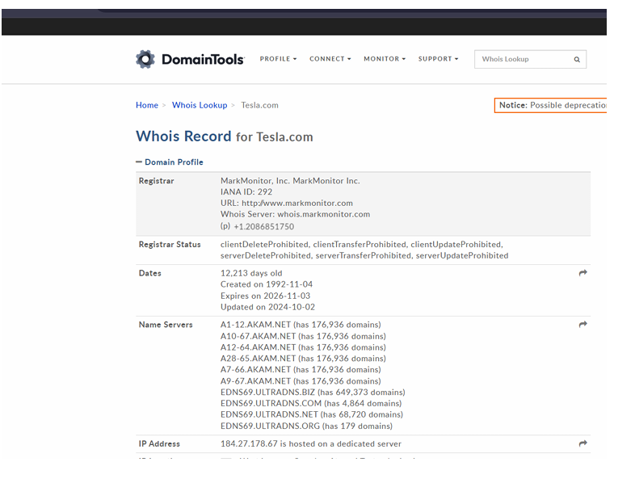
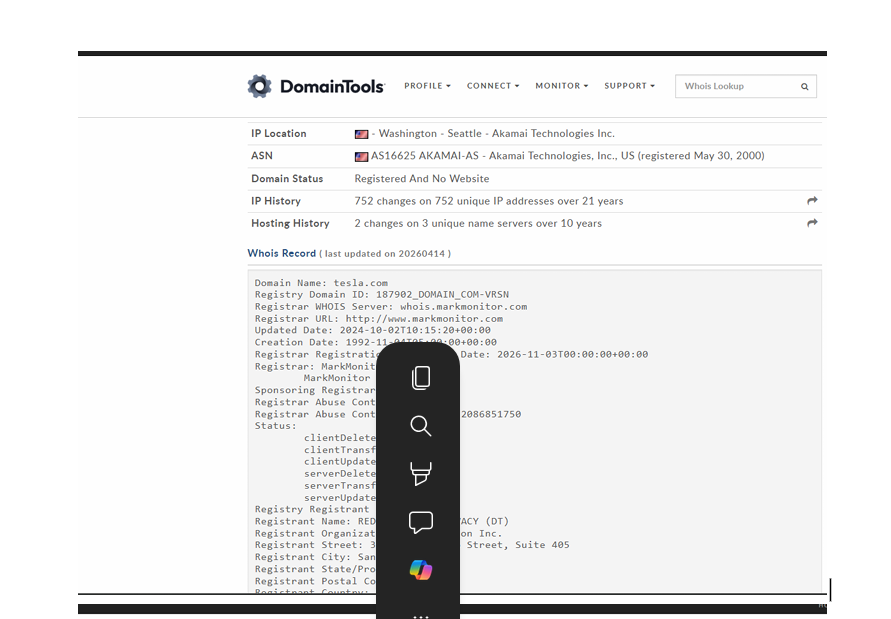
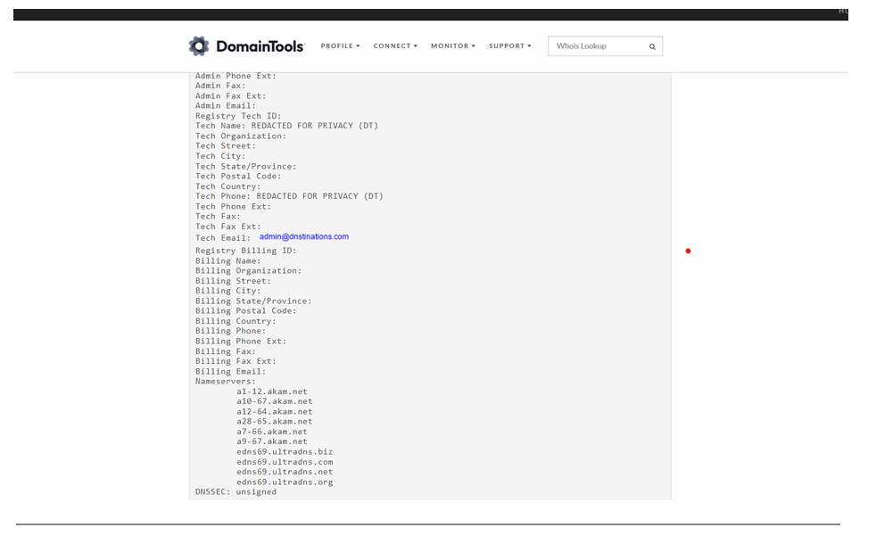
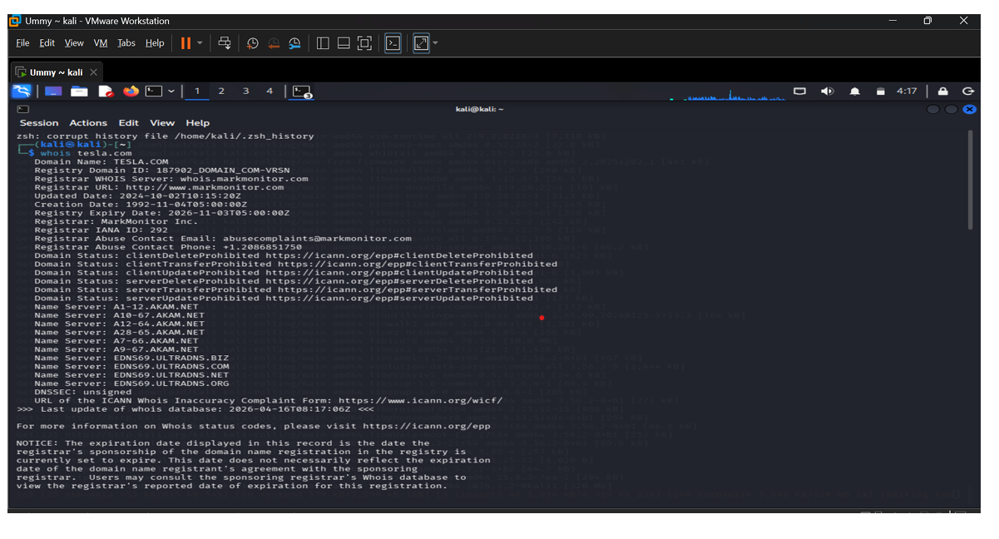
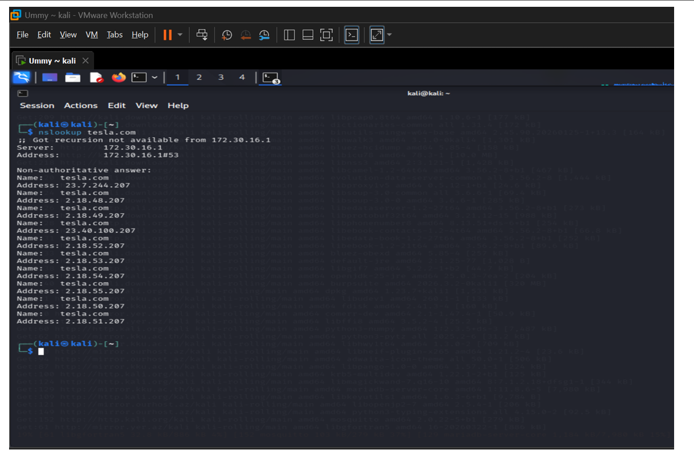
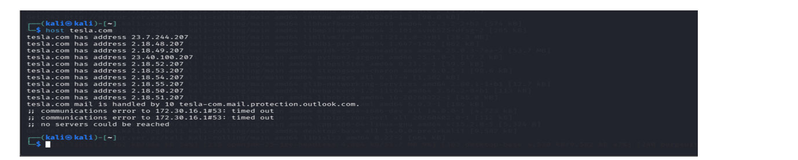

# Week 2 Lab Task — Information Gathering (OSINT)

## Recon Report – Tesla

---

## 1. Domain Ownership (WHOIS)

| Field | Details |
|-------|---------|
| Registrar | MarkMonitor |
| Organization | DNStination Inc. (privacy protected) |
| Created | 1992 |
| Status | Transfer & update protected |

Indicates strong domain security.

 

---

## 2. IP Addresses

- `23.7.244.207`
- `23.40.100.207`
- `2.18.48.207` – `2.18.55.207`

Multiple IPs indicate CDN usage via **Akamai Technologies** — not the real origin server.

 

---

## 3. Emails & Subdomains

- **Mail Server:** `tesla-com.mail.protection.outlook.com`
- Uses **Microsoft (Outlook/Exchange Online)** for email hosting
- No subdomains discovered in this step

 

 

 

---

## 4. Shodan (Services)

- No direct backend services visible
- Only CDN-related HTTP/HTTPS traffic expected
- Real infrastructure is hidden behind the CDN

---

## 5. Suspicious Indicators

- No major misconfigurations found
- CDN effectively conceals real infrastructure
- Large attack surface likely exists in subdomains

 

---

## Conclusion

The main domain is well protected with privacy measures and CDN shielding.

Further recon should focus on **subdomains** and **hidden/backend services**.
