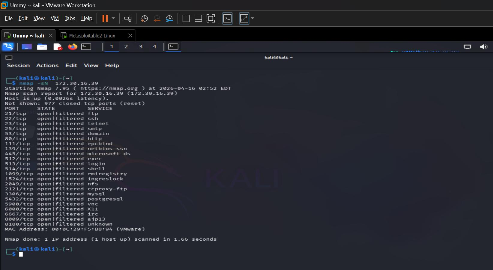
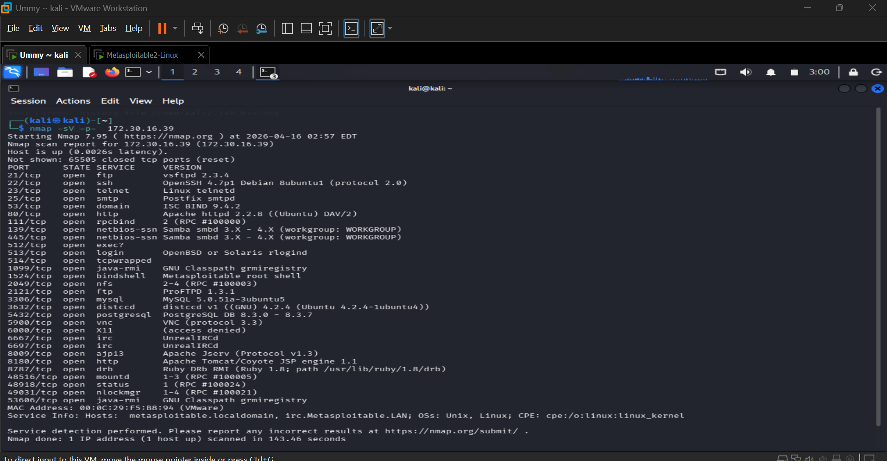
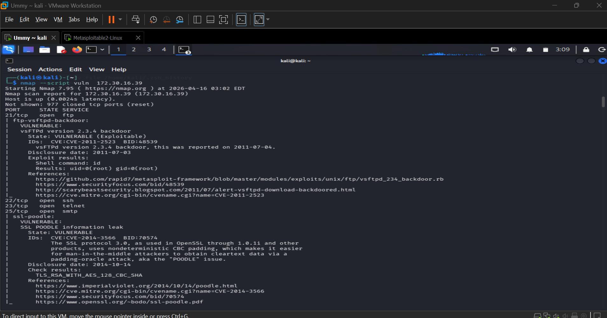
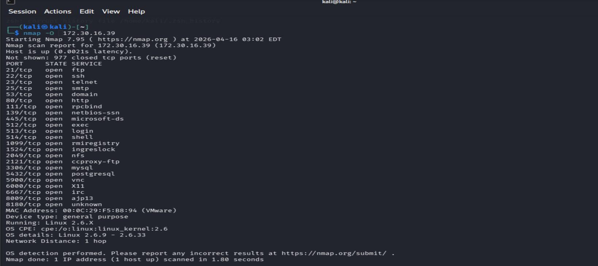
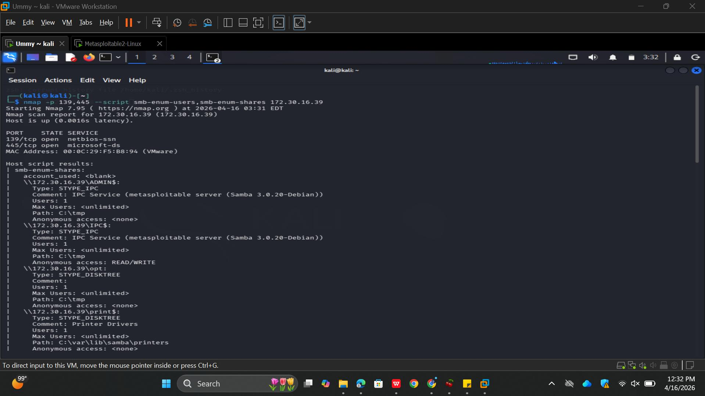

# Week 3 Lab Task — Scanning & Enumeration

## Scan Report – Metasploitable 2

---

## 1. Host Discovery (Ping Sweep)

A network sweep was performed to identify active systems on the host-only network.

* Target subnet scanned: `192.168.56.0/24`
* Active host discovered: `172.30.16.39`
* Host responded with low latency, confirming it is online

 

---

## 2. Full Port Scan & Service Detection

A full TCP port scan with version detection identified multiple exposed services.

| Port   | Service | Version / Description             |
| ------ | ------- | --------------------------------- |
| 21/tcp | FTP     | vsFTPd 2.3.4                      |
| 22/tcp | SSH     | OpenSSH                           |
| 23/tcp | Telnet  | Remote login service              |
| 25/tcp | SMTP    | Postfix mail server               |
| 53/tcp | DNS     | Domain Name Service               |
| 80/tcp | HTTP    | Apache Web Server (DVWA detected) |

These open services indicate a broad attack surface.

 

---

## 3. Operating System Detection

OS fingerprinting suggests the target is running a Linux-based operating system.

* Likely distribution: Ubuntu / Debian based
* Multiple legacy services indicate outdated environment

 

---

## 4. Vulnerability Scan (Nmap NSE)

Automated vulnerability scripts revealed several security weaknesses.

| Service | Vulnerability                         | Risk     |
| ------- | ------------------------------------- | -------- |
| FTP     | vsFTPd 2.3.4 Backdoor (CVE-2011-2523) | Critical |
| SMTP    | POODLE / LOGJAM / Weak SSL            | High     |
| HTTP    | DVWA web app vulnerabilities          | High     |
| Telnet  | Cleartext authentication              | Medium   |

 

---

## 5. SMB Enumeration

Anonymous SMB enumeration exposed shares and usernames.

### Discovered User Accounts

| Username | Status | Notes            |
| -------- | ------ | ---------------- |
| msfadmin | Active | Valid local user |

### Discovered Shares

| Share Name | Access                 | Risk     |
| ---------- | ---------------------- | -------- |
| IPC$       | Anonymous Access       | Medium   |
| tmp        | Read / Write Anonymous | Critical |
| ADMIN$     | Restricted             | Low      |
| opt        | Restricted             | Low      |
| print$     | Restricted             | Low      |

 

 

---

## 6. Key Security Findings

### Null Session Enabled

Anonymous users can enumerate usernames and shares without credentials.

### Writable Anonymous Share

The `tmp` share allows file upload without authentication, creating potential for abuse or code execution.

### User Enumeration Exposure

Valid usernames such as `msfadmin` were disclosed, increasing brute-force risk.

---

## Conclusion

The Metasploitable 2 machine contains multiple intentionally vulnerable and outdated services. Critical findings include the vsFTPd backdoor, writable anonymous SMB shares, Telnet exposure, and weak cryptographic configurations. This target is highly insecure and demonstrates common misconfigurations useful for security training and enumeration practice.
