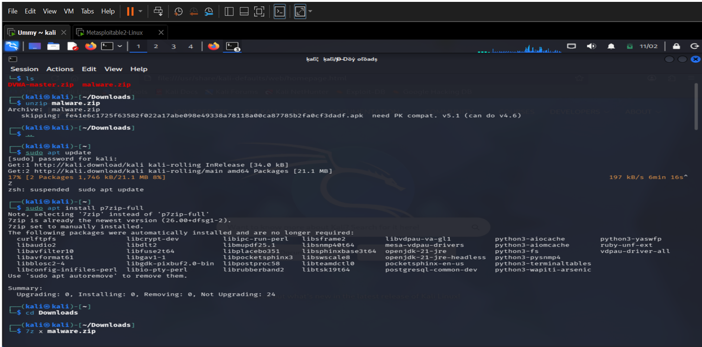
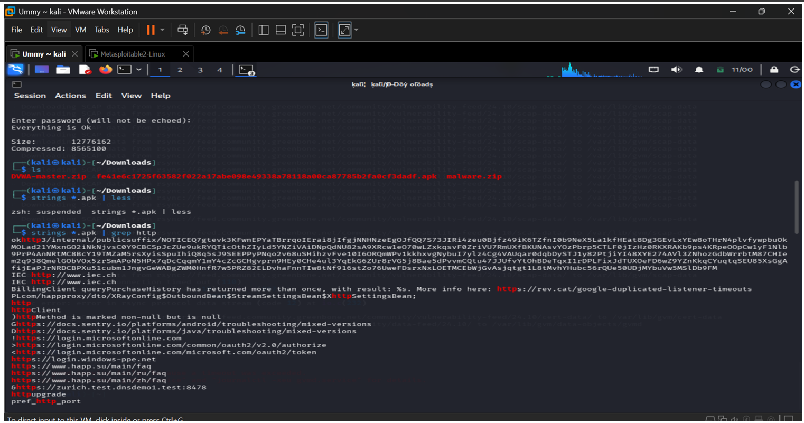

# Week 5 Lab Task — Malware Analysis

## Analysis Report – Suspicious Android APK

---

## Objective

Analyze a malware sample to identify its behavior, possible impact, indicators of compromise, and recommended mitigation steps.

---

## Sample Information

| Field       | Details                                                            |
| ----------- | ------------------------------------------------------------------ |
| File Type   | Android APK                                                        |
| SHA256 Hash | `fe41e6c1725f63582f022a17abe098e49338a78118a00ca87785b2fa0cf3dadf` |

 

---

## 1. Static Analysis Findings

Initial static inspection revealed several suspicious indicators inside the APK file.

### Key Findings

* File identified as an **Android application package (APK)**
* Suspicious URLs discovered:

  * `https://rev.cat/...`
  * `https://play.google.com/...`
* Network communication library detected:

  * **okhttp3**
* Suspicious keywords present:

  * `httpMethod`
  * `login`
  * `password`
* Encoded or obfuscated strings found

These indicators suggest hidden functionality and network communication behavior.

 

---

## 2. Behavioral Analysis

The APK appears to use HTTP-based communication libraries to contact remote servers.

### Possible Behaviors

* Sends requests to external servers
* Receives commands remotely
* Transfers device or user data
* Uses obfuscation to hide malicious logic

This behavior may indicate command-and-control (C2) communication.

---

## 3. Malware Classification

Based on observed indicators, the sample is likely a **Trojan**.

### Reasons

* Communicates with remote infrastructure
* Contains hidden or encoded strings
* Uses networking libraries
* May impersonate a legitimate application

---

## 4. Indicators of Compromise (IoCs)

| Type    | Indicator                    |
| ------- | ---------------------------- |
| URL     | `rev.cat/...`                |
| URL     | `play.google.com/...`        |
| Library | `okhttp3`                    |
| Strings | Encoded / Obfuscated content |

These indicators can be used for detection and blocking.

---

## 5. Attack Vector

Possible infection methods include:

* Installation of malicious APK files
* Download from third-party app stores
* Fake software updates
* Phishing links
* Social engineering messages

---

## 6. Potential Impact

If installed, the malware may cause:

* Theft of sensitive data
* Credential harvesting
* Unauthorized device access
* Background communication with attacker
* Privacy compromise

---

## 7. Remediation

If infection is suspected:

* Uninstall the malicious application
* Scan device using trusted antivirus tools
* Block suspicious domains and URLs
* Reset passwords used on the device
* Review app permissions
* Monitor for unusual activity

---

## 8. Prevention

To reduce risk:

* Install apps only from trusted sources
* Keep Android OS updated
* Avoid unknown APK downloads
* Use mobile endpoint protection
* Review requested permissions before install
* Enable Google Play Protect

---

## Conclusion

The analyzed APK displays characteristics consistent with a Trojan-style Android malware sample. It uses network communication libraries, contains suspicious strings, and likely communicates with external servers. Strong security hygiene, trusted app sources, and regular updates are essential to prevent similar mobile threats.
