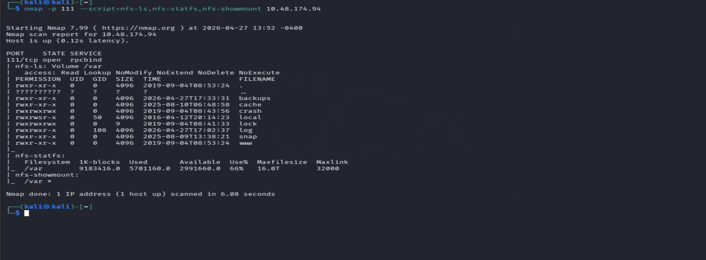
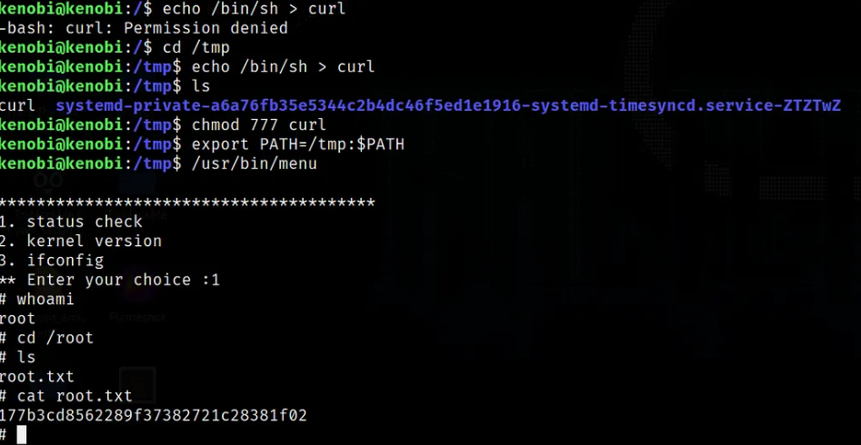

                                                Assignment: Linux Privilege Escalation and Kenobi Lab Report

# 🐧 Linux Privilege Escalation Lab (TryHackMe)

A hands-on security audit and privilege escalation exercise on a Linux target machine.  
This room explored **21 different attack vectors** used to gain elevated access through weak permissions, misconfigurations, and vulnerable services.

---

## 🎯 Objective

Identify privilege escalation paths and obtain root access by exploiting insecure system configurations.

---

## 💥 Key Exploitation: MySQL UDF Injection

The most impactful finding was a **MySQL service running with root privileges**.  
By abusing **User Defined Functions (UDF)**, system-level command execution was achieved.

---

## 🛠️ Methodology

### Custom Shared Library
- Compiled malicious `.so` file using `gcc`
- Used `-fPIC` flag for compatibility with MySQL memory space

### Binary to BLOB Injection
- Converted exploit file into binary data (BLOB)
- Inserted into temporary MySQL table

### Restricted Directory Write
- Used `INTO DUMPFILE`
- Dropped payload into:

```bash
/usr/lib/mysql/plugin/
```

---

## 🐚 Root Shell Access

- Registered `do_system()` function
- Modified `/bin/bash` SUID permissions
- Spawned persistent root shell

---

## ⚔️ Attack Vectors Covered

### 🔧 Services
| Vector | Description |
|---|---|
| MySQL UDF Exploitation | RCE via malicious shared library |
| Shared Object Injection | `.so` file hijacking |
| SUID / SGID Abuse | Binaries running with elevated perms |

### 🔐 Permissions
| Vector | Description |
|---|---|
| Writable `/etc/passwd` | Add root user directly |
| Writable `/etc/shadow` | Hijack password hashes |

### ⏰ Automation
| Vector | Description |
|---|---|
| Cron Job PATH Hijacking | Malicious script placed in PATH |
| Wildcard Expansion Abuse | `tar`, `rsync` wildcard tricks |

### 🧩 Sudo Misconfigurations
| Vector | Description |
|---|---|
| Shell Escape Sequences | Break out of restricted sudo commands |
| LD_PRELOAD Exploitation | Inject shared library via env variable |

---

## 🧬 Internal Escalation

| Vector | Description |
|---|---|
| Kernel Exploit Theory | Understanding kernel-level attacks |
| DirtyCow | CVE-2016-5195 write-anywhere exploit |
| DirtyPipe | CVE-2022-0847 pipe overwrite exploit |
| NFS Root Squashing | Misconfigured NFS share escalation |

---

## 📚 Lessons Learned

### ⚠️ Root Fallacy
> Protecting user accounts is useless when background services run with excessive privileges.

### 🔍 Debugging Matters
Using the `-g` flag during compilation helped troubleshoot library behavior and linking issues.

---

## 🔒 Security Recommendations

- ✅ Enable `secure_file_priv` in MySQL
- ✅ Restrict plugin directories
- ✅ Apply Principle of Least Privilege (PoLP)
- ✅ Audit cron jobs and writable paths
- ✅ Remove unnecessary SUID binaries

---

## 🏁 Final Result

- ✔️ Root access obtained  
- ✔️ 21 privilege escalation vectors reviewed  
- ✔️ Real-world Linux hardening lessons learned  

---

## 📸 Screenshots


---

> ⚠️ *For educational and authorized lab environments only.*


# 🔫 Kenobi – System Auditing & Lateral Movement (TryHackMe)

A full-stack security assessment of the Kenobi Linux environment, focusing on service misconfigurations, insecure network file sharing, and SUID-based privilege escalation.

---

## 🛡️ Objective

Identify and exploit chained vulnerabilities across SMB, FTP, NFS, and SUID misconfigurations to achieve full root access on the target system.

---

## 🔎 Phase 1: Network Reconnaissance & Enumeration

The engagement began with an intensive Nmap sweep to map the attack surface.

### Findings

| Service | Version / Detail | Notes |
|---|---|---|
| FTP | ProFTPD 1.3.5 | Critical vulnerability found |
| SSH | OpenSSH | Used for initial access |
| HTTP | Apache | Web surface |
| SMB | Samba | Anonymous share exposed |

### SMB Analysis

- Leveraged `nmap` scripts and `smbclient` to enumerate network shares
- Discovered an `/anonymous` share with publicly readable files
- Manually inspected server log files to **map the internal file structure** of the target

```bash
# SMB enumeration
nmap -p 445 --script=smb-enum-shares,smb-enum-users <target-ip>
smbclient //<target-ip>/anonymous
```

---

## 💾 Phase 2: Vulnerability Research (ProFTPD 1.3.5)

Focused research on ProFTPD version 1.3.5 revealed a critical flaw in the `mod_copy` module.

### The Exploit — `mod_copy` Abuse

The `mod_copy` module allows unauthenticated users to copy files on the server using two commands:

| Command | Function |
|---|---|
| `CPFR` | Copy From — specify source path |
| `CPTO` | Copy To — specify destination path |

### The Pivot

By chaining these commands, the user's **private SSH key** (`id_rsa`) was moved from a restricted home directory to a world-readable location:

```bash
CPFR /home/kenobi/.ssh/id_rsa
CPTO /var/tmp/id_rsa
```

> 🔑 The key was now accessible without any authentication.

---

## 🚀 Phase 3: Initial Access via NFS Mounting

With the SSH key relocated, NFS (Network File System) was used to mount the remote directory locally.

### Steps

```bash
# Mount the remote NFS share
sudo mount <target-ip>:/var/tmp /mnt/kenobiNFS

# Retrieve the SSH key
cp /mnt/kenobiNFS/id_rsa ~/.ssh/
chmod 600 id_rsa

# Connect as kenobi
ssh -i id_rsa kenobi@<target-ip>
```

✅ Stable SSH session established as user `kenobi`.

---

## ⚡ Phase 4: Privilege Escalation — PATH Hijacking via SUID Binary

Post-exploitation involved a systematic audit to identify escalation vectors.

### SUID Binary Search

```bash
find / -perm -u=s -type f 2>/dev/null
```

### The Finding

A **non-standard SUID binary** was discovered that called system utilities (e.g., `curl`, `status`) using **relative paths** instead of absolute paths like `/usr/bin/curl`.

### The Exploit — PATH Manipulation

```bash
# Create a malicious script named after the called binary
echo '/bin/bash' > /tmp/curl
chmod +x /tmp/curl

# Prepend /tmp to PATH so our script is found first
export PATH=/tmp:$PATH

# Execute the vulnerable SUID binary
/usr/local/bin/<vulnerable-binary>
```

🎯 **Result: Root shell obtained.**

---

## 📈 Key Takeaways

### 1. 🔗 Vulnerability Chaining
> A low-severity SMB share leak provided the internal file path needed to execute a high-severity FTP exploit — neither vulnerability alone would have been sufficient.

### 2.  Relative Path Danger
> Custom Linux automation scripts that call binaries without absolute paths are vulnerable to PATH hijacking — a common mistake in real-world environments.

---

## 🔒 Security Recommendations

- ✅ Disable `mod_copy` in ProFTPD or restrict it to authenticated users
- ✅ Restrict NFS exports with `root_squash` and IP whitelisting
- ✅ Audit all SUID binaries — remove unnecessary ones
- ✅ Always use **absolute paths** in scripts and system binaries
- ✅ Restrict anonymous SMB share access

---

## 🏁 Final Result

- ✔️ Full network enumeration completed  
- ✔️ ProFTPD `mod_copy` exploit executed  
- ✔️ SSH key extracted via NFS  
- ✔️ Root shell obtained via PATH hijacking  

---

## 📸 Screenshots





---

> ⚠️ *For educational and authorized lab environments only.*


Lab 2  Kenobi Room (TryHackMe)

This lab was a full security assessment of a Linux machine where I learned how to combine multiple small weaknesses (SMB, FTP, NFS, SUID misconfigs) to eventually gain root access.

I started with network scanning and service enumeration using Nmap and discovered exposed services like FTP (ProFTPD 1.3.5), SMB shares, SSH, and Apache. The SMB share allowed anonymous access, which helped me explore internal files and understand the system structure.

Next, I researched the FTP service and found a vulnerability in ProFTPD 1.3.5 related to the mod_copy feature. This allowed file copying on the server without authentication, so I used it to move the user’s SSH private key (id_rsa) into a readable location.

After that, I accessed the key through an NFS-mounted directory, fixed permissions, and logged in via SSH as the user kenobi.

Finally, I looked for privilege escalation paths and found a SUID binary that used relative paths. I exploited this using PATH hijacking by creating a malicious executable in /tmp, which was executed with elevated privileges, giving me a root shell.

Overall, I learned how small misconfigurations across different services can be chained together to fully compromise a system—from enumeration to root access.


