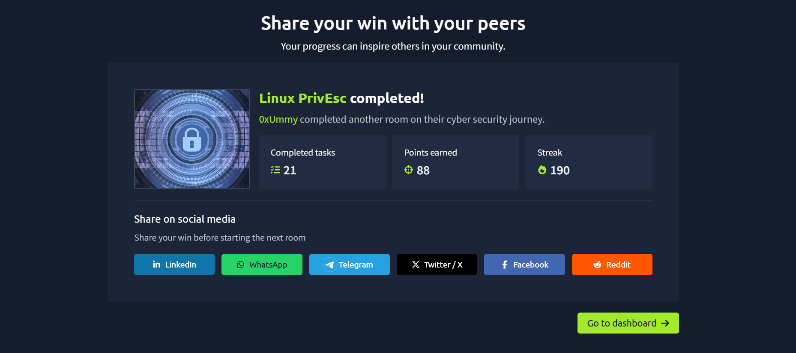
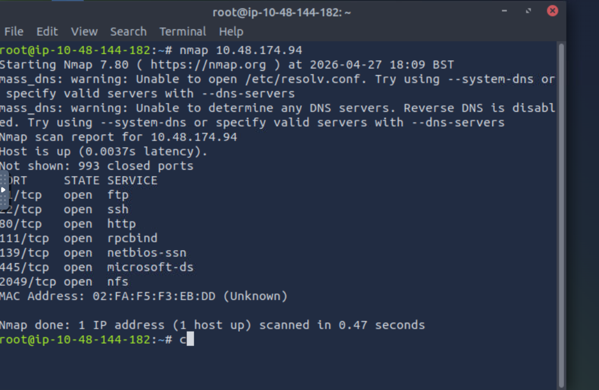
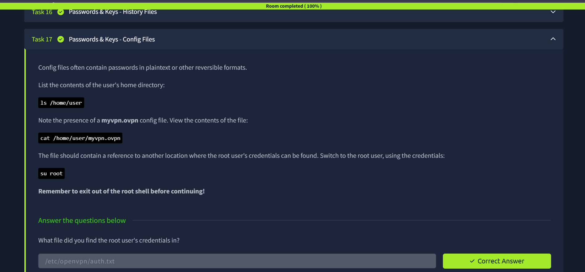

# 🐧 Linux Privilege Escalation Lab (TryHackMe)

A hands-on security audit and privilege escalation exercise on a Linux target machine.  
This room explored **21 different attack vectors** used to gain elevated access through weak permissions, misconfigurations, and vulnerable services.

---

## 🎯 Objective

Identify privilege escalation paths and obtain root access by exploiting insecure system configurations.

---

## 💥 Key Exploitation: MySQL UDF Injection

The most impactful finding was a **MySQL service running with root privileges**.  
By abusing **User Defined Functions (UDF)**, system-level command execution was achieved.

---

## 🛠️ Methodology

### Custom Shared Library
- Compiled malicious `.so` file using `gcc`
- Used `-fPIC` flag for compatibility with MySQL memory space

### Binary to BLOB Injection
- Converted exploit file into binary data (BLOB)
- Inserted into temporary MySQL table

### Restricted Directory Write
- Used `INTO DUMPFILE`
- Dropped payload into:

```bash
/usr/lib/mysql/plugin/
```

---

## 🐚 Root Shell Access

- Registered `do_system()` function
- Modified `/bin/bash` SUID permissions
- Spawned persistent root shell

---

## ⚔️ Attack Vectors Covered

### 🔧 Services
| Vector | Description |
|---|---|
| MySQL UDF Exploitation | RCE via malicious shared library |
| Shared Object Injection | `.so` file hijacking |
| SUID / SGID Abuse | Binaries running with elevated perms |

### 🔐 Permissions
| Vector | Description |
|---|---|
| Writable `/etc/passwd` | Add root user directly |
| Writable `/etc/shadow` | Hijack password hashes |

### ⏰ Automation
| Vector | Description |
|---|---|
| Cron Job PATH Hijacking | Malicious script placed in PATH |
| Wildcard Expansion Abuse | `tar`, `rsync` wildcard tricks |

### 🧩 Sudo Misconfigurations
| Vector | Description |
|---|---|
| Shell Escape Sequences | Break out of restricted sudo commands |
| LD_PRELOAD Exploitation | Inject shared library via env variable |

---

## 🧬 Internal Escalation

| Vector | Description |
|---|---|
| Kernel Exploit Theory | Understanding kernel-level attacks |
| DirtyCow | CVE-2016-5195 write-anywhere exploit |
| DirtyPipe | CVE-2022-0847 pipe overwrite exploit |
| NFS Root Squashing | Misconfigured NFS share escalation |

---

## 📚 Lessons Learned

### ⚠️ Root Fallacy
> Protecting user accounts is useless when background services run with excessive privileges.

### 🔍 Debugging Matters
Using the `-g` flag during compilation helped troubleshoot library behavior and linking issues.

---

## 🔒 Security Recommendations

- ✅ Enable `secure_file_priv` in MySQL
- ✅ Restrict plugin directories
- ✅ Apply Principle of Least Privilege (PoLP)
- ✅ Audit cron jobs and writable paths
- ✅ Remove unnecessary SUID binaries

---

## 🏁 Final Result

- ✔️ Root access obtained  
- ✔️ 21 privilege escalation vectors reviewed  
- ✔️ Real-world Linux hardening lessons learned  

---

## 📸 Screenshots





---

> ⚠️ *For educational and authorized lab environments only.*
